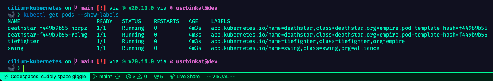
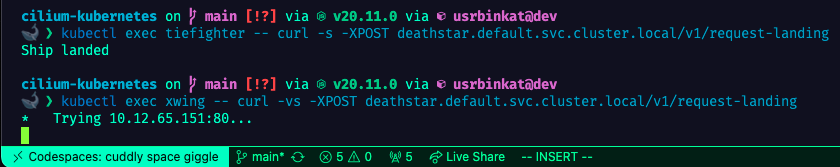

# Cilium + Kubernetes + Pulumi

[]() [](https://www.pulumi.com/docs/get-started/install/) [](https://docs.cilium.io/en/v1.9/gettingstarted/kind/) [](https://kubernetes.io/docs/tasks/tools/install-kubectl/) [](https://docs.docker.com/get-docker/) [](https://kind.sigs.k8s.io/docs/user/quick-start/) [](https://helm.sh/docs/intro/install/)

[](https://codespaces.new/usrbinkat/cilium-kubernetes)

[](https://github.com/usrbinkat/cilium-kubernetes/actions/workflows/ci.yaml)

## DevOps & Network Policy as Code

This repository contains an implementation of the [Cilium Network Policy](https://docs.cilium.io/en/v1.9/gettingstarted/kind/#deploy-cilium) demo powered by Pulumi's Typescript [Infrastructure as Code](https://www.pulumi.com/what-is/what-is-infrastructure-as-code) (IaC). The demo showcases the deployment and validation of network policy enforcement.

[Cilium](https://cilium.io/) is an open-source project that provides networking and security for applications running on Kubernetes. It offers enhanced network visibility, load balancing, and network security features.

[Pulumi](https://www.pulumi.com/) is an open-source infrastructure as code tool that allows you to define, deploy, and manage cloud infrastructure using familiar programming languages. It provides a consistent and programmable way to provision and manage resources across different cloud providers.

[KinD (Kubernetes-in-Docker)](https://kind.sigs.k8s.io/) is a tool for running local Kubernetes clusters using Docker container "nodes". It allows you to create and manage Kubernetes clusters for development and testing purposes.

In this demo, we are using Pulumi, Kind Kubernetes, and Cilium to showcase how to deploy and manage a Kubernetes cluster and enhanced networking and security features with IaC.

### How To

To try the Cilium Network Policy demo, follow these steps:

0. [Open this project in GitHub Codespaces](https://codespaces.new/usrbinkat/cilium-kubernetes)
1. Create Kind Kubernetes Cluster
2. Deploy Cilium
3. Deploy Cilium Network Policy
4. Test Cilium Network Policy
5. Cleanup

#### 1. Create Kind Kubernetes Cluster

```bash
make kind
```

### 2. Deploy Cilium and Cilium Network Policy

```bash
# Pulumi Login && Install Typescript Dependencies
pulumi login && pulumi install

# Pulumi Create/Select Stack
pulumi stack select --create $GITHUB_USER/cilium-kubernetes/dev

# Pulumi Deploy Stack
pulumi up
```

### 3. Check pods and labels

The network policy is enforced by matching policies to pods based on their labels. The `tiefighter` pod has the label `app=starwars` and the `xwing` pod has the label `app=starwars` and `role=xwing`.

```bash
# Check that the pods are running & have appropriate labels
kubectl get pods --show-labels
```



### 4. Test Cilium Network Policy

We will use curl to test the network policy. The `tiefighter` pod is compliant with the policy and the `xwing` pod is non-compliant. The `tiefighter` pod should be able to access the `deathstar` and return `Ship landed`, while the `xwing` pod will fail to respond due to traffic policy denying the traffic.

```bash
# Curl policy compliant
kubectl exec tiefighter -- curl -s -XPOST deathstar.default.svc.cluster.local/v1/request-landing

# Curl policy compliant
kubectl exec xwing -- curl -s -XPOST deathstar.default.svc.cluster.local/v1/request-landing

# Curl policy non-compliant
kubectl exec xwing -- curl -vs -XPOST deathstar.default.svc.cluster.local/v1/request-landing
```



#### 4. Cleanup

```bash
# Pulumi Destroy Stack & Delete Kind Cluster
make clean

# Stop Github Codespaces
make stop
```

> After stopping the GH Codespace go to the GH Codespaces dashboard and delete the Codespace
>
> - https://github.com/codespaces

### Repo Tree

> Index of important files in this project.
>
> ```bash
> cilium-kubernetes on  main [!] via  v20.11.0 via  usrbinkat@dev
> 🐋 ❯ tree -a -I .git -I .devcontainer -I node_modules
> .
> ├── README.md                # Overview and documentation for the project
> ├── index.ts                 # Main TypeScript file for Pulumi
> ├── Pulumi.yaml              # Pulumi project configuration file
> ├── tsconfig.json            # TypeScript configuration file
> ├── Makefile                 # Makefile for automating setup and deployment
> ├── hack                     # Directory of dev scripts and configurations
> │   └── kind.yaml            # KinD cluster configuration file
> │
> ├── LICENSE                  # License file for the project
> ├── package.json             # NPM package configuration file
> ├── package-lock.json        # NPM package lock file
> │
> ├── .envrc                   # Direnv configuration file
> ├── .gitignore               # Specifies intentionally untracked files to ignore
> ├── .gitmodules              # Git Submodule configuration file
> ├── .github
> │   ├── konductor            # Git submodule for GitHub Codespaces Devcontainer
> │   └── workflows/ci.yaml    # Github Actions Runner CI workflow
> ├── .kube                    # Kubernetes configuration directory
> │   └── config               # Kubernetes credentials file (gitignored)
> └── .pulumi                  # Pulumi configuration and state files
>     └── credentials.json     # Pulumi credentials (gitignored)
>
> 6 directories, 24 files
> ```

## Alternative manual steps

<details>

```bash
########################################################################
# Create Kind Cluster
kind create --config hack/kind.yaml

# Add cilium helm repo
helm repo add cilium https://helm.cilium.io

# Deploy cilium
helm upgrade --install cilium cilium/cilium --namespace kube-system --version 1.14.5 --values hack/cilium.yaml

# cilium status
cilium status --wait --wait-duration 2m0s

########################################################################
# Starwars Empire vs Rebels Demo App
# https://docs.solo.io/gloo-network/main/quickstart/#policy

export CILIUM_VERSION=1.14.5
kubectl create ns starwars
kubectl -n starwars apply -f https://raw.githubusercontent.com/cilium/cilium/$CILIUM_VERSION/examples/minikube/http-sw-app.yaml

# Apply policy
kubectl apply -f hack/ciliumnetpol.yaml
kubectl get ciliumnetworkpolicy

# Curl policy compliant
kubectl exec tiefighter -n starwars -- curl -s -XPOST deathstar.starwars.svc.cluster.local/v1/request-landing

# Curl policy non-compliant
kubectl exec xwing -n starwars -- curl -s -XPOST deathstar.starwars.svc.cluster.local/v1/request-landing

# check labels
kubectl get pods -n starwars --show-labels
```

</details>

## Contributing

Contributions are welcome! If you find any issues or have suggestions for improvements, please open an issue or submit a pull request.

## License

This project is licensed under the [MIT License](LICENSE).
